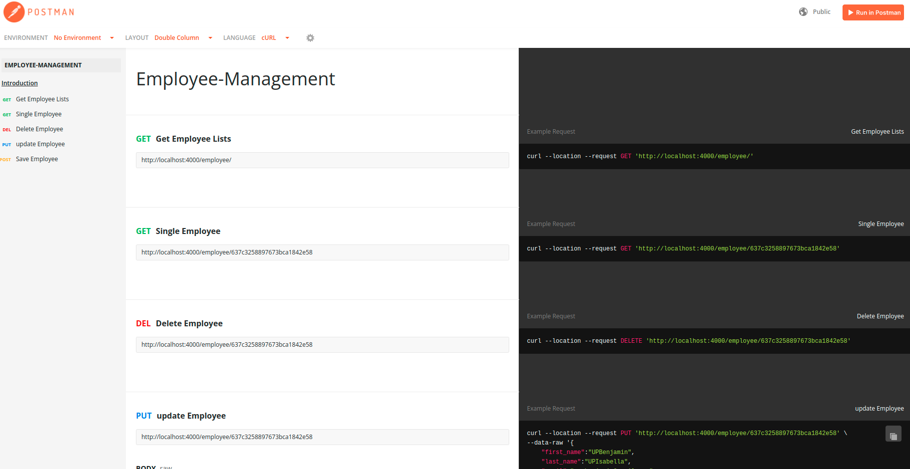

# Welcome to Employee Manager
Employee management is a simple CRUD-based application to manage employees. this application builds up using react js and node js. we can simply add delete,edit search employee.

## API Documentation
[API Documentation](https://documenter.getpostman.com/view/16940700/2s8YmULKrh)

## Run the following commands to run the project

Clone the repository
In the project directory,run following command to install npm modules
### `npm install`

Create .env file and add the mongodb url path

Run the following command to start the project

### `npm start`

Run the following command to run the test cases
### `npm test`